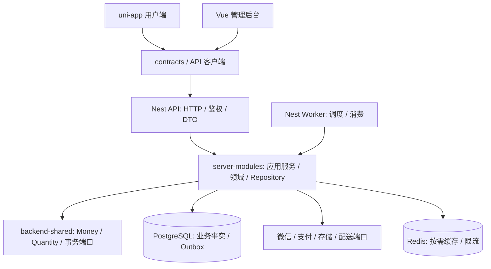
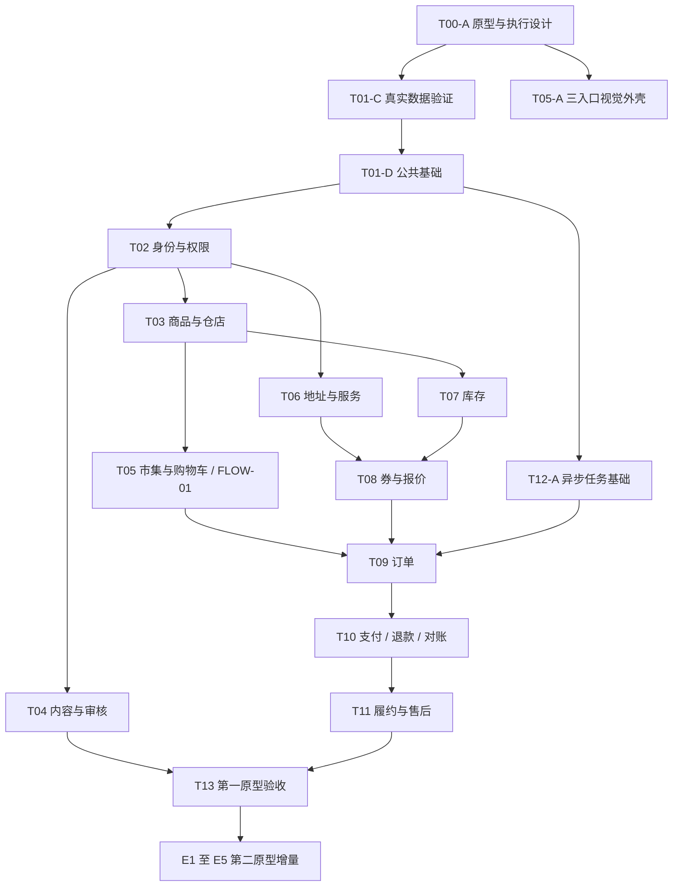

# 开发路线与执行流程

规划日期：2026-10-08。范围依据是用户指定的 5000、50000 两个原型，先完成第一原型，再进入第二原型的实现。本文是执行设计；任务状态仅写在 [tasks.md](tasks.md)，实测证据仅写在 [progress.md](progress.md)。

## 1. 审查结论

保留现有技术栈与工程，不重建项目。总体设计 v1 对模块化单体、PostgreSQL 事务、整数金额、交易状态分离、支付未知态、售后不自动回库等方向合理，两个原型的功能描述也大体对应本次读取的 HTML。需要把总体方案变成阶段清晰、能逐批验收的实施计划。

| 发现 | 工程证据 | 调整 |
|---|---|---|
| 当前是框架入口，业务尚未实现 | API 只有 /health；Worker 没有任务；两端占位页；contracts/backend-shared 空导出；Prisma 只有 EngineeringProbe | 保留 T01 进行中，禁止把工程测试当商城验收 |
| T00 空缺，原型与实际功能容易混淆 | 5000 的标签只改样式，选规格直接加购，结算未绑定；50000 多个入口只 toast | 建立快照、功能映射、补充需求和决策清单，逐项追踪 |
| T01 是过大的整体门槛 | 本地编译、远程 CI、数据库、支持周期混在一起 | 按真实依赖开工；远程 CI 与安全审核是集成/发布门槛，不阻塞独立设计与页面工作 |
| T12 排在订单/支付之后 | T09 已需超时，T10 已需查单与补偿 | 将 T12-A Outbox/租约/重试基础提前，业务消费者随所属功能交付 |
| 共享后端规则缺少代码归属 | 四个共享包均未提供模块，Worker 空上下文 | 计划新增 server-modules 专供 API/Worker；不把完整领域塞进 backend-shared |
| T06 依赖 T04，T08 依赖整个 T06 太宽 | 地址/券不需要社区完成；报价只需要地址、库存与券子集 | 使用具体子任务依赖，避免串行等待无关模块 |
| 一期与二期视觉可能要求推倒重做 | P1 三入口，P2 五入口且直播未设计 | 复用领域能力与业务组件，页面外壳按阶段更新；不同时维护两套独立交易实现 |
| 扩展方案被误当原型必需 | 多仓/FEFO/称重/AI/平台分账并非两个原型都明确要求 | 移入可选后续，不作为 P2 原型验收前置条件 |
| 文档与命令有偏差 | 根 test 脚本没有自动 build；development 有“当前无第三方依赖”等旧描述 | 明确先 build 后 test，整理历史与当前环境说明 |

## 2. 阶段与完成定义

默认规划目标为完整可用功能，分阶段接入真实交易。是否只需演示版仍待用户选择；默认不把演示通过记为真实交易完成，不据此启动第二原型代码。设计采用默认值推进，外部账号与经营政策在对应任务接入前确认。

| 阶段 | 输出 | 离开阶段的门槛 |
|---|---|---|
| G0 | 当前工程审查、原型映射、架构、任务依赖、待决策清单 | 每个 P1/P2 入口都有任务；业务假设有确认时点；不代表全部政策已冻结 |
| M0 | T01 工具与数据验证；T01-D 公共基础 | 本地类型/构建/进程测试通过；使用真实 PostgreSQL 验证迁移、事务、约束、重试；关键基础可供模块使用 |
| M1 | T02 身份权限、T03 商品后台、T05 市集/购物车 | 后台发布商品→小程序浏览/加购→重新登录与服务重启仍恢复；失败状态可解释 |
| M2 / P1-A | 社区、我的、服务、基础券、明确标记的演示结算 | P1-01～P1-12 的功能与补充入口可演示；用户私人数据隔离；平台未验证项仍单列 |
| M3 | 库存、报价、订单、真实支付/退款、人工履约与售后 | 完整订单与退款链路、异步恢复、资金对账和不变量测试通过 |
| M4 / P1-B | 第一原型完整功能验收与经营门槛 | P1-A + 真实交易 + 微信真机 + 恢复演练 + 远程 CI/发布检查通过；账号/政策/素材明确 |
| M5 | 第二原型商城体验升级 | 首页/分类/详情/搜索/完整车/结算偏好/订单工具覆盖 P2-01～P2-08，第一阶段回归通过 |
| M6 | 第二原型会员、资产、活动、服务、系统与直播 | P2-09～P2-14 每个入口有规则、实际结果与验收；未定项阻塞对应任务，不静默删掉 |

P1-A 是中间交付点，P1-B 是默认进入第二阶段代码的门槛。若用户选择“只做演示”，在任务日志明确替代门槛与延期功能后可调整，不能自动因商户配置缺失跳过。用户授权开始开发不等于授权发布、充值、退款或真实付款操作。

## 3. 架构与模块落地

新增 server-modules 的实际 workspace manifest、exports、编译依赖与目录检查在 T01-D 中交付，本批只设计，不提前改变八包基线。API 和 Worker 只做进程装配；Worker 不通过复制规则或 import API 的 main.ts 复用业务。两个入口共用同一后端模块版本，库存/资金仍由模块公开接口操作。

模块分组是开发与代码归属安排，不表示每个模块都是一个部署服务：

| 组 | 模块与事实所有权 | 首次需要 | 公开边界 |
|---|---|---|---|
| 基础 | Database、Config、Audit、Job/Outbox、Asset | T01-D/T04-A/T12-A | 事务上下文、审计追加、事件追加、上传票据；不提供任意跨表 CRUD |
| 身份 | Identity、IAM、Customer | T02/T06-A | 会话校验、权限/仓范围、自己的资料和地址 |
| 商品 | Store、Catalog、Pricing | T03 | 当前仓 SKU、可售、价格与规则版本查询；一期价目由 Pricing 持有 |
| 内容 | Content、CMS | T04/T03-C | 草稿/审核/公开查询、目标状态点赞/关注、固定模板内容发布 |
| 交易 | Cart、Promotion、Inventory、Order | T05/T08/T07/T09 | 单仓车版本、券冻结/释放、库存预占/出库、订单编排 |
| 经营 | Payment、Fulfillment、AfterSale、Finance | T10/T11 | 渠道意图/查单、履约动作、行级售后、对账差异处理 |
| 二期 | Membership、Loyalty、Wallet、Campaign、Service | E2/E3/E4 | 独立资格/权益/积分/资金事实，具体任务开工前细化 |

原设计把“Loyalty 的会员资格”和后续“Membership”混用：执行时采用 Membership 负责付费会员/额度，Loyalty 负责积分/成长值；两者通过资格与授予接口协作。一期等级展示可先只有基础等级，未配置成长政策不展示伪造进度，成长账本在确有规则的任务中实现。

### 3.1 事务、API 与数据约束

- 每个应用服务声明它拥有的表。跨模块建单由 Order 的编排服务持有唯一事务上下文，各公开服务接收同一上下文；事务内禁止外部网络请求。
- 库存、券、订单、幂等记录、成功审计、Outbox 在同一本地事务提交。每个交易设计必须列出锁顺序；跨建单、付款、取消、退款共同访问的对象应使用一致顺序，SKU按仓/SKU排序。具体锁图在T07/T09/T10规格中验证，不能只验证单个操作内部有序就称不存在死锁。
- 金额持久化使用整数分；API 的 `*Minor` 为十进制整数字符串；后端计算使用 bigint 或具备安全整数范围校验的 Money 类型。前端只格式化，不转 Number 后做结算运算。
- 一期数量为正整数包装件，单位由 SKU 规定；套餐默认独立固定 SKU。自选组件、克重实结算、自动补扣款不在一期，进入范围前单独设计。
- 单仓订单；库存 `available = on_hand - reserved - damaged`，余额有 CHECK，业务动作有唯一键。购物车不预占库存。付款确认消耗权益，实物出库才扣 on_hand。
- 订单、支付尝试、退款、履约状态独立。客户端支付回执只用于提示，结果由服务端验签/查单确认。未知状态保留查单任务，晚支付按原设计补偿。
- 写接口输入白名单，owner 从会话取得；版本冲突返回 409，业务失败稳定错误码。HTTP 普通接口统一 requestId；供应商 Webhook 独立格式。
- OpenAPI 与 contracts 必须有单一来源：T01-D 先建立 DTO/schema 约定和生成探针；选择能适配两端编译器的生成器后锁版。禁止手工维护两份同名金额/状态契约。
- PostgreSQL 保留 Outbox + job_run + Inbox 与租约。首版使用数据库任务领取，Redis 先用于需要的缓存/限流；BullMQ 是规模和兼容性验证后的候选，不额外阻塞首版 Worker。

### 3.2 前端与后台

小程序 pages 布局和生命周期、features 业务交互、services 请求、stores 会话/界面状态、platform 微信能力；两端共享 contracts/ui-tokens，Vue/Pinia/Vite 按各自已锁版组合保留。P1 tab 为发现/市集/我的；P2 再升级为首页/分类/直播/购物车/我的。第一阶段用户数据与订单连续保留，路由迁移有回归用例。

后台按任务同时交付运营入口：商品、分类、仓店、内容审核、固定 CMS、券、库存、订单履约、售后、对账。先最小可用表单/表格，再评估组件库；不先造通用低代码后台。用户端任何发布/券/交易能力必须有必要的后台处理入口。

数据库只随当前任务创建所需表。EngineeringProbe 使用专用 PoC 数据库，不能混成业务库存；业务测试另用隔离库。迁移必须在空库和升级库验证，描述应用回退与数据前向修复，禁止默认清库恢复。

## 4. 推荐执行次序

T05-A 可在数据库排障期间实施页面外壳与 fixture 视觉验证，明确是演示证据。FLOW-01 必须使用真实持久化、真实权限，不能用 fixture 提前结项。数据库不可用时继续规格/契约/视觉/纯领域设计，不把 SQLite/内存库验收当 PostgreSQL 事务验收。

下一批优先完成 T01-C1/C2/C3 和 T00-B 的相关配置确认，再做 T01-D。若 Docker 本地不可用，可独立规划受控开发 PostgreSQL/Redis，但现有 PoC 拒绝远程数据库，接入前必须新设计隔离与保护条件，不能直接删除保护检查。

## 5. 每个任务的工作流程

1. 开始：读取 AGENTS、任务/进度、相关规格与 ADR；检查 Git 状态，不覆盖已有改动。
2. 开工门槛：核实具体依赖、外部条件和未决规则；只让相关任务阻塞。
3. 规格：先在 openspec/changes 的对应变更补行为、失败用例、权限、API、表归属、事务/幂等、恢复与验收。普通视觉改动轻量记录即可。
4. 实现：一个可演示的纵向范围同时覆盖需要的后台、API、用户端；不得先写一整套未知业务数据库。
5. 验证：规则单测→真实数据库/API集成→相关页面流程；工程级变化运行 typecheck/build，测试先 build。明确 mock、真实服务、H5、开发工具、真机各证据级别。
6. 审阅：diff --check、完整 tracked diff、新文件内容、迁移与生成文件；无密钥、真实私人数据和构建制品。
7. 收尾：tasks 只达标才完成，progress 写证据/限制/阻塞/下一步；实现完成后才同步当前能力 specs。需要时仅提交本批改动；推送与发布另确认。

任务建议控制在一次可验证批次：例如“单仓 SKU 后台发布与公开读取”而不是“完整商品系统”。一个任务超过一批时继续拆 A/B 子项，不能靠百分比替代验收。

## 6. 质量门槛与排期方式

不沿用总体设计的 2前端+2后端+1测试团队排期作为本项目承诺。当前团队、预算、每日投入、素材和账号未确定，按任务验收驱动，完成首个 FLOW-01 后用实际批次耗时重估。每批报告完成了哪些用户行为、通过哪些用例和下一批入口。

第一阶段必测：跨用户/跨仓越权；购物车版本冲突与重启恢复；未审核内容不公开；最后一件并发预占；券重复使用；重复建单；晚回调与关单竞态；退款数量/金额上限；食品售后不误回库；Worker 重启/重放；真机授权拒绝与弱网。

第二阶段必测：两段吸顶与滚动恢复；搜索清空和零结果；失效商品/勾选/立即购买隔离；会员到期/续费/额度跨周期；积分冻结/退款/来源过期；活动限额/预算/失败退款；钱包卡兑换与并发资金上限；发票/通知/设置权限；第一阶段回归。

## 7. 决策与外部条件清单

责任人“用户/业务”表示需业务输入，“研发”表示可依据工程验证决策，不是假定存在额外团队。

| 决策 | 规划默认 | 责任人 | 最晚确认 |
|---|---|---|---|
| P1 完成目标 | P1-A→P1-B→P2，真实交易分阶段接入 | 用户 | T00-B / P2 开始前 |
| 品牌与商品 | 灵域商城、授权/自有素材，固定包装 SKU，单自营仓店 | 用户/业务 | T03-A；生产素材在 T13-B 前 |
| 自提/配送 | 两种入口保留；配置实际营业/区域，自提无需配送地址 | 用户/业务 | T03-A/T08-B |
| 券和运费 | 规则版本化，样例值只用于 prototype-profile；互斥与退款明确 | 用户/业务 | T08-A/B |
| 等级/成长值 | 未配置时基础等级、真实零进度；不预置最高会员 | 用户/业务 | T06-C |
| 社区 | 图文发布审核、点赞/关注/举报；评论与挂商品二期 | 用户/业务 | T04-A |
| 微信/商户/域名/存储 | 缺配置只阻塞对应真实能力，不伪造微信身份/支付 | 用户提供配置，研发验证 | T02-C/T04-A/T10-A/T13 |
| 售后与配送 | 人工处理、行级退款、自提核销、配送事件；无虚构 GPS/ETA | 用户/业务 | T11-A |
| 会员/积分/钱包/活动 | 每类有独立规则、来源、额度/预算、退款政策 | 用户/业务 | E2/E3 对应设计任务 |
| 直播 | 未设计，比较外部连接和供应商接入；保留未完成状态 | 用户/业务、研发 | E5-A |
| 多仓/称重/FEFO/AI | 可选后续，独立规格与任务，不阻塞 P2 原型范围 | 用户/业务 | 明确提出再实施 |

## 8. 首个业务批次的设计入口

FLOW-01 的待实现规格见 [phase1-baseline](../openspec/changes/phase1-baseline/specs.md)。其范围是后台可发布固定 SKU、游客可浏览、登录用户加购并持久化，以及真实权限/版本冲突验证。基础登录适配与数据服务是前置，支付、会员、复杂库存不在这个贯通任务内。

后续任务设计按模块开工即时深化，例如 T07 前补库存迁移/锁顺序，T10 前补渠道版本和回调验签方案。避免一次写完所有二期表和接口后才开始验证。
